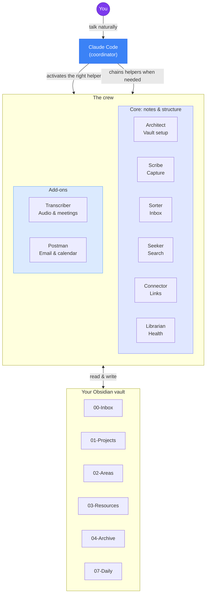
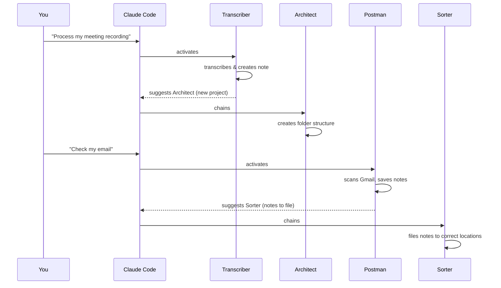

# MaxisOS

### Eight helpers inside [Claude Code](https://claude.ai/code) that organize your [Obsidian](https://obsidian.md) notes so you do not have to.

You talk in normal language. They file notes, link ideas, search your vault, handle meeting text, and help with email. They can reply in whatever language you use.

**In one sentence:** MaxisOS is a set of pre-built “modes” for Claude Code—each mode is tuned for one job (writing notes, sorting the inbox, searching, and so on). You stay in chat; your vault stays tidy behind the scenes.

---

## Why this exists

Life throws a lot at you: things to read, people to follow up with, deadlines, half-finished ideas at night, and a full inbox. Carrying all of that in your head gets exhausting. Things slip.

Lots of people use Obsidian as a “second brain,” but keeping it organized can feel like a second job—folders, links, and cleanup.

MaxisOS is built for people who want **a simple way to dump thoughts and let something else handle the filing**—not for people who love tweaking systems for fun.

---

## What makes it different

Many “AI + notes” setups assume you already have habits and just want a small boost. MaxisOS is aimed at people who feel **overloaded** and want a gentler path.

**1. Chat is the main interface.**  
You do not need to click around Obsidian or rebuild folder trees by hand. You describe what you want; the right helper does the work.

**2. Your language is fine.**  
Write in Italian, French, German, Spanish, Japanese, or anything else you prefer. The helpers follow your language.

**3. The helpers work as a team.**  
One helper can hand off to another when it makes sense—for example, after a meeting note mentions a new project, the setup helper can create the right folders. They are coordinated by the main Claude Code flow, not eight separate apps you have to wire up yourself.

---

## Who this is for

- Anyone with **brain fog** or a very full head who still needs to stay on top of life and work
- **Non-native English speakers** who want a system that works in their own language
- People who **tried Obsidian** and quit because it felt like too much admin

If you have ever thought *“I need to get organized, but I am too tired to get organized,”* this is for you.

---

## Important disclaimers

> **Please read the [full disclaimers](docs/DISCLAIMERS.md) before using this project.**

Key points:

- **This software is for personal use on your own data.** You are responsible for privacy laws (such as GDPR or CCPA) if you handle other people’s information (for example, emails that mention them).
- **No warranty.** Provided “as is.” Back up your vault. The author accepts no liability.
- **No responsibility for forks or misuse.** This is a personal productivity tool. Malicious repurposing is explicitly condemned.

> **By using this software, you agree to the [Terms of Use](TERMS_OF_USE.md).** During onboarding, the Architect will ask you to explicitly accept these terms before proceeding.

---

## The crew (your eight helpers)

Each row is a **role** Claude Code can use when you ask for that kind of work. You do not need to remember technical names—plain requests like “save this” or “sort my inbox” are enough.

| # | Name | What it does |
|---|------|----------------|
| 1 | **Architect** | Vault layout, first-time setup, and the rules everyone follows |
| 2 | **Scribe** | Turns rough thoughts into clear notes |
| 3 | **Sorter** | Clears your inbox-style area and puts notes where they belong |
| 4 | **Seeker** | Finds things in your vault and answers with pointers to sources |
| 5 | **Connector** | Suggests links between notes you might not have noticed |
| 6 | **Librarian** | Regular health pass: duplicates, broken links, simple stats |
| 7 | **Transcriber** | Recordings and transcripts → structured meeting notes |
| 8 | **Postman** | Connects Gmail and Google Calendar to your vault (deadlines, prep) |

> **They chain when useful.** Example: after a meeting surfaces a new project, the flow can bring in the Architect to create folders. After email is pulled in, the Sorter can file new notes. You still steer everything in chat.

---

## How it works

```
You describe what you need  →  Claude Code picks the right helper  →  Your vault updates
```

You put this project inside your Obsidian vault, run the installer once, then open **Claude Code** with that vault as the project folder. From there you mostly **talk**; you are not expected to micromanage files.

### Simple picture

- **You** speak in everyday language.
- **Claude Code** (with a subscription—see Quick start) is the app that runs on your computer and reads these helpers’ instructions.
- **Your vault** is normal Obsidian storage on disk—the helpers read and write notes there.

### Architecture (for curious readers)



### Example: helpers handing off



### Claude Code in the terminal and on the desktop

The installer sets up **two parallel formats** so the same helpers work in both places:

| Format | Location | Used by |
|--------|----------|---------|
| **Agent files** | `.claude/agents/` | Claude Code in the terminal (`claude`) |
| **Skills** | `.claude/skills/` | Claude Code Desktop / Cowork |

You do not pick one. `launchme.sh` installs both. Same helpers, same behavior; only the file format differs.

Your vault uses a hybrid **PARA + Zettelkasten** layout (a common note-taking structure: projects, areas, resources, plus flexible linking):

```
00-Inbox/          Drop new stuff here first
01-Projects/       Active work with deadlines
02-Areas/          Ongoing responsibilities
03-Resources/      Reference material, guides
04-Archive/        Older or finished material
05-People/         People you track
06-Meetings/       Meeting notes
07-Daily/          Daily notes and journals
MOC/               Topic indexes (“maps of content”)
Templates/         Reusable note layouts
Meta/              Settings, logs, health reports
```

---

## Quick start

> **What you need:** [Claude Code](https://claude.ai/code) with a **Claude Pro, Max, or Team** plan, and [Obsidian](https://obsidian.md) (free). Claude Code is Anthropic’s coding assistant; here you use it as the engine that runs MaxisOS inside your vault.

### 1. Create your Obsidian vault

Open Obsidian and create a new vault (or use one you already have).

### 2. Clone this repo inside your vault

```bash
cd /path/to/your-vault
git clone https://github.com/gnekt/My-Brain-Is-Full-Crew.git MaxisOS
```

(If the repository URL changes, clone from the URL you use for this project and use a folder name you like; the steps below assume the folder is named `MaxisOS`.)

### 3. Run the installer

```bash
cd MaxisOS
bash scripts/launchme.sh
```

The script asks a few questions and copies the helpers into your vault’s `.claude/` folder. When Claude Code is opened **in your vault folder**, they are available; other folders on your computer are unaffected.

> **New to the terminal?** See [docs/getting-started.md](docs/getting-started.md), or ask someone comfortable with computers to run the two commands for you.

### 4. Initialize

Open Claude Code **in your vault folder** and say:

> **"Initialize my vault"**

The **Architect** runs a short onboarding chat:

1. **Who are you?** Name, language, what you are trying to solve  
2. **What do you need?** Which helpers to turn on, which parts of life to support  
3. **Connections** (optional): Gmail and Google Calendar  

After that, you get a sensible folder layout, a saved profile, a welcome note, and you can start using the system.

### 5. Example things to say

| You say | What happens |
|---------|-------------|
| *"Save this: meeting with Marco about the Q3 budget, he wants the report by Friday"* | **Scribe** turns it into a clear note with tasks and dates |
| *"Triage my inbox"* | **Sorter** files items and gives you a short summary |
| *"What did we decide about the pricing strategy?"* | **Seeker** searches and answers with references to your notes |
| *"Check my email"* | **Postman** pulls important items and highlights deadlines |
| *"Weekly review"* | **Librarian** checks links, duplicates, and general health |
| *"Find connections for my latest note"* | **Connector** suggests related notes |

---

## Works in any language

The templates are written in English, but **replies follow the language you write in**. Italian, French, Spanish, German, Portuguese, Japanese—just type naturally.

```
"Salva questa nota veloce..."          → Italian reply
"Vérifie mon email..."                 → French reply
"Was habe ich diese Woche geplant?"    → German reply
"Check my inbox"                       → English reply
```

No extra language packs to install for that behavior.

---

## Works from your phone too

You can drive MaxisOS from your phone using Claude Code’s **Remote Control**: your computer runs Claude Code with your vault; your phone is a remote screen. Quick capture on a walk, inbox check from the couch, and so on—all still executing on your machine.

> **[Full setup](docs/mobile-access.md)** (about two minutes)

---

## How helpers coordinate (plain English)

When a helper finishes and sees a natural next step for another helper, it can **suggest** that next step in its reply. Claude Code can then run that follow-up for you, so you are not manually switching “modes” for every small chain.

Examples:

- Meeting note → new project → **Architect** can add folders  
- Email scan → new notes in inbox → **Sorter** can file them  
- Orphan notes found → **Librarian** can take a closer look  
- New “area” of life appears → **Architect** can extend structure  

---

## Optional connections (email and calendar)

The **Postman** helper uses:

- **Gmail** (to read and summarize mail you choose to connect)  
- **Google Calendar** (events and light schedule context)  

Those use small connector configs (`mcp.json`). `launchme.sh` can help set them up; you approve access when Claude Code asks.

All other helpers only need your local vault—no Google required.

### Updating after `git pull`

```bash
cd /path/to/your-vault/MaxisOS
git pull
bash scripts/updateme.sh
```

Only project files update; your personal notes stay as they are.

---

## Recommended Obsidian plugins

**Useful for many people:** Templater, Dataview, Calendar, Tasks  

**Nice extras:** QuickAdd, Folder Notes, Tag Wrangler, Natural Language Dates, Periodic Notes, Omnisearch, Linter  

---

## Project structure

```
MaxisOS/                             ← cloned inside your vault
├── agents/                          The eight helper definitions (terminal format)
│   ├── architect.md
│   ├── scribe.md
│   ├── sorter.md
│   ├── seeker.md
│   ├── connector.md
│   ├── librarian.md
│   ├── transcriber.md
│   └── postman.md
├── skills/                          Desktop/Cowork format (generated)
│   └── {name}/SKILL.md
├── references/                      Shared instructions for helpers
├── scripts/
│   ├── launchme.sh
│   ├── updateme.sh
│   └── generate-skills.py
├── docs/
│   ├── getting-started.md
│   ├── examples.md
│   └── agents/
├── .mcp.json                        Optional Gmail + Calendar connectors
├── .claude-plugin/plugin.json
├── LICENSE
├── README.md
└── CONTRIBUTING.md
```

After `launchme.sh`, your vault typically looks like:

```
your-vault/
├── .claude/
│   ├── agents/
│   ├── skills/
│   └── references/
├── CLAUDE.md
├── .mcp.json            ← if you enabled connectors
├── MaxisOS/             ← this repo (for updates)
└── ... your notes
```

---

## Contributing

MaxisOS started as one person’s tool, shared in case it helps others. **Improvements are welcome:** clearer instructions, better helper behavior, bug fixes, or real-world examples.

If you want to:

- **Improve a helper** (smarter defaults, edge cases)  
- **Tighten wording** so newcomers understand faster  
- **Suggest a new helper** for a clear use case  
- **Report a bug**  
- **Share how you use MaxisOS**  

…open a PR or issue. See [CONTRIBUTING.md](CONTRIBUTING.md).

---

## Philosophy

> *"The best organizational system is the one you actually use."*

MaxisOS favors **low friction**:

- **Chat first**—minimal manual filing  
- **Helpers do repetitive work**—linking, sorting, light maintenance  
- **Any language**—you should not have to switch languages to stay organized  
- **Careful defaults**—helpers avoid destructive actions; they archive instead of deleting and ask before big moves when it matters  

---

## Star the repo

If MaxisOS helps you, a star makes it easier for others to discover and encourages ongoing work.

---

## License

MIT: use it, change it, share it. Keep attribution.

**THE SOFTWARE IS PROVIDED "AS IS", WITHOUT WARRANTY OF ANY KIND, EXPRESS OR IMPLIED.** The authors are not liable for any claim, damages, or other liability arising from the use of this software. See the [MIT License](LICENSE) for full terms.

---

<p align="center">
  <i>MaxisOS — for when your brain is full.</i>
  <br><br>
  <a href="docs/getting-started.md"><strong>Get started</strong></a> · <a href="docs/examples.md"><strong>Examples</strong></a> · <a href="docs/agents/architect.md"><strong>Meet the helpers</strong></a> · <a href="CONTRIBUTING.md"><strong>Contribute</strong></a>
</p>
